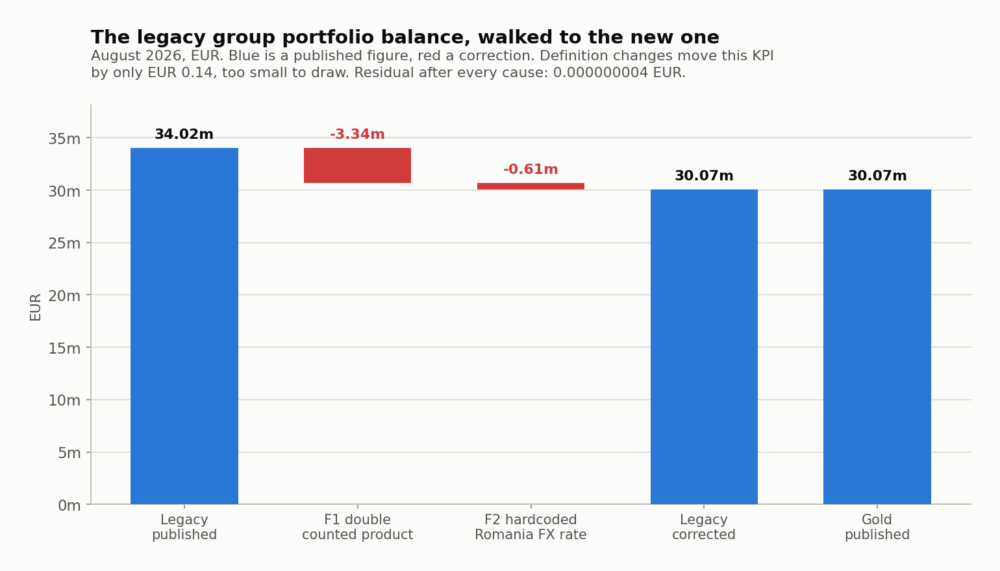
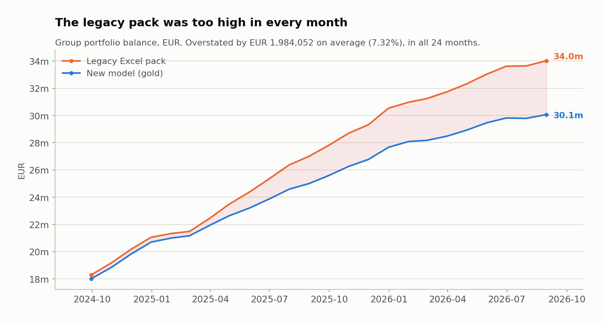
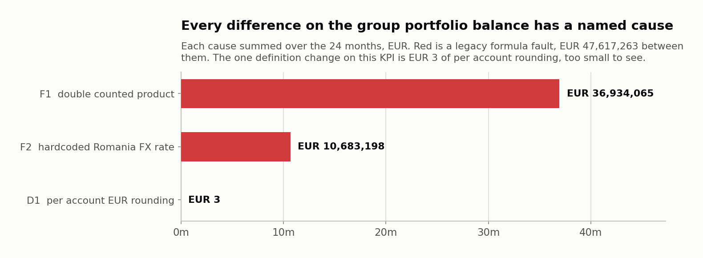
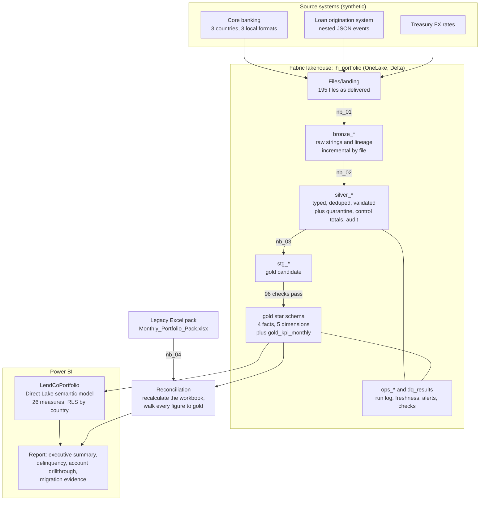
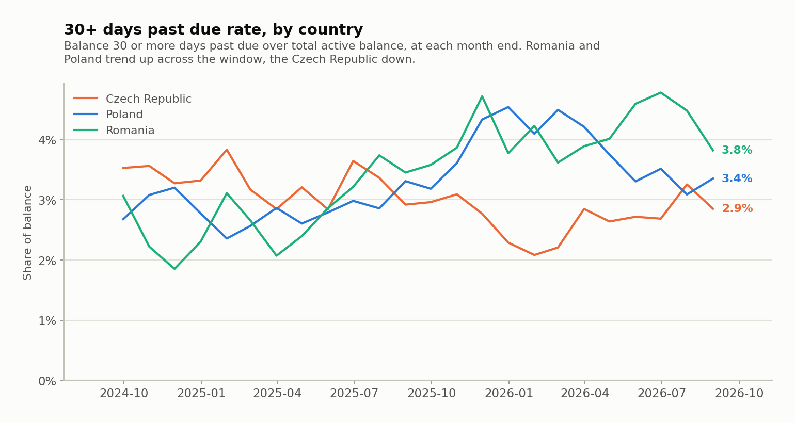
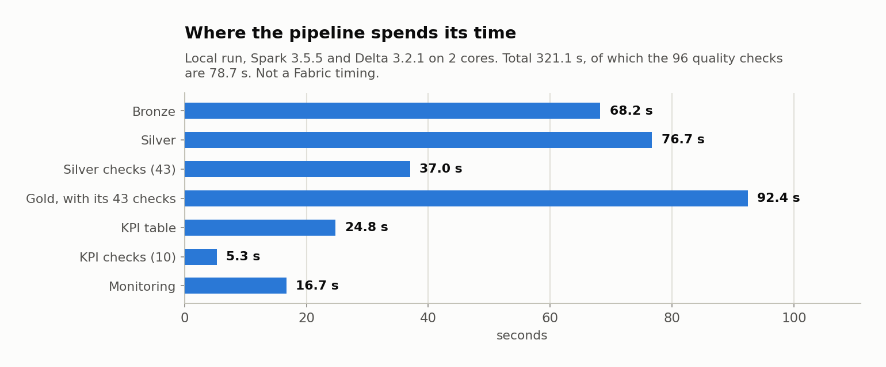

# Legacy Excel to Microsoft Fabric: consumer credit portfolio reporting migration

A consumer lender (personal loans and credit cards in Poland, the Czech Republic
and Romania) produces its monthly board portfolio pack from a formula driven
Excel workbook. This project migrates that pack to a Microsoft Fabric medallion
lakehouse with a Direct Lake Power BI model, and reconciles every published
figure against the old workbook to prove which numbers were wrong.

The reconciliation is the point. The pipeline is how you get to it.

> **Status:** all 7 phases built. Every number in this README comes from a run
> output committed in `docs/results/` or `data/`, and
> [a test](tests/test_documentation.py) fails if any of them stops matching.
>
> **Where it has run:** everything quoted here was measured locally, on Spark
> 3.5.5 and Delta 3.2.1 (the versions Fabric Runtime 1.3 uses) in a container and
> in GitHub Actions. **Nothing has run in a Fabric tenant yet**, because a Fabric
> trial is not available for this account and Direct Lake needs a Fabric capacity.
> The Fabric items are authored, generated and tested as text. No Fabric timing
> and no screenshot is quoted until a real run produces one.
>
> **The data is synthetic**, generated from a fixed seed. The defects in it are
> deliberate and documented.

## What the migration found

672 published figures were compared, month by month and country by country
(24 month ends, 4 scopes, 7 KPIs). 498 differed. **Nothing was left unexplained.**

Three faults in the legacy workbook's own formulas, affecting 336 of those 672
figures. Each was proved by correcting that formula in a copy of the workbook and
recalculating it, so the effect is measured rather than argued.

| | The fault | Largest single month effect |
|---|---|---|
| F1 | Cards were summed with the wildcard product code `CC*`. The card consolidation loan is a personal loan whose code starts with CC, so it was counted twice from its launch in March 2025 | Group balance overstated by EUR 3,336,161.01 |
| F2 | The Romania tab multiplied by the literal `0.2012`, while the column showing the correct Treasury rate sat unused beside it | Group balance overstated by EUR 614,059.94 |
| F3 | The 30+ days past due numerator filtered on the previous month end while the denominator used the current one, so the first month of the series reported 0.00% | 30+ rate wrong by 3.53 percentage points |



*Drawn from `data/reconciliation/bridge.csv`. Not a Power BI screenshot: see [Figures and screenshots](#figures-and-screenshots).*

Effect on what the board has been reading, over the 24 months:

* The group portfolio balance was overstated in **every single month**, by
  EUR 1,984,052.50 on average (7.32%), between EUR 282,650.13 and EUR 3,950,221.10.
* Arrears were **understated**: the group 30+ rate averaged 3.041% in the legacy
  pack against 3.246% in the new model.





Everything else is an agreed definition change (5 with a measurable effect) or
currency conversion rounding. After every cause is removed the residual is at
most 0.000000004 EUR on any amount and 1e-16 on any rate.

Full write up with the proof for each finding, the diagnosis trail and the
attribution of every difference:
**[docs/RECONCILIATION_FINDINGS.md](docs/RECONCILIATION_FINDINGS.md)**.

The reconciliation also found a bug in the **new** model: Spark caps the scale
when one decimal column is divided by another, which had truncated every gold
rate to 6 decimal places. The rate residual broke tolerance, which is how it
surfaced. It was fixed before anything was published, and a quality check now
fails if rates ever look truncated again
([issue 10](docs/ISSUES_AND_FIXES.md)).

## Architecture



If the diagram does not render: landed files, then bronze (raw as delivered),
then silver (cleaned, with a quarantine), then gold written to staging and
published only if the quality checks pass, then a Direct Lake model and the
report. The legacy workbook is recalculated and reconciled against gold, and the
run log, freshness and alert tables sit alongside.

Orchestrated by the data pipeline `pl_portfolio_medallion`: bronze, silver and
gold on success, then monitoring on success, failure **or** skip, because a
failed run still has to raise the alarm.

## How it works

| Phase | What it does | Where |
|---|---|---|
| 1 | Simulates the lender's core systems, writes the landed files with realistic defects, and builds the legacy Excel pack with three seeded faults | [concepts](docs/concepts/01-legacy-world.md), [steps](docs/fabric-steps/phase-1.md) |
| 2 | Medallion lakehouse: bronze, silver and gold in PySpark, shipped to Fabric as a wheel, with thin notebooks | [concepts](docs/concepts/03-medallion-design.md), [steps](docs/fabric-steps/phase-2.md) |
| 3 | 96 declarative quality checks and the write, audit, publish gate | [concepts](docs/concepts/04-data-quality-gates.md), [steps](docs/fabric-steps/phase-3.md) |
| 4 | The reconciliation: every legacy figure walked to its gold counterpart in named steps | [concepts](docs/concepts/05-reconciliation.md), [findings](docs/RECONCILIATION_FINDINGS.md) |
| 5 | Direct Lake semantic model as TMDL, 26 documented measures, RLS by country, report spec | [concepts](docs/concepts/06-semantic-model.md), [measures](docs/MEASURES.md), [report spec](docs/REPORT_SPEC.md) |
| 6 | Git integration, deployment rules, run log, freshness and alerts | [concepts](docs/concepts/07-production-operations.md), [steps](docs/fabric-steps/phase-6.md) |
| 7 | This README, the [runbook](docs/RUNBOOK.md) and the [teardown](docs/TEARDOWN.md) | |

### The data

Generated from seed 42, 24 month ends from 2024-09-30 to 2026-08-31
(`data/generation_manifest.json`):

| Core system table | Rows |
|---|---|
| Customers | 30,545 |
| Applications | 34,714 |
| Accounts | 16,569 |
| Month end balance snapshots | 225,357 |
| Repayments | 194,017 |

195 landed files in each country's own format (Czech `;` separators and `,`
decimals, Romanian `dd/mm/yyyy` dates), with trailer control totals and six kinds
of transport defect: a re-sent file (2,869 rows), repeated repayment rows (376),
blank account ids (9), padded lower case product codes (1,009), earlier PENDING
application events (969) and truncated JSON lines (37).

### Silver lost nothing

From the committed run output
[docs/results/phase6_local_run.json](docs/results/phase6_local_run.json):

| Entity | Bronze rows | Trailers | Quarantined | Duplicates | Silver rows |
|---|---|---|---|---|---|
| balances | 228,308 | 73 | 9 | 2,869 | 225,357 |

225,357 is exactly the true number of balance rows, and a test compares all of
them value by value against the simulated truth. The same equation holds for
every entity on every run, and it is written to `silver_load_audit`, so it does
not have to be argued.

## KPI definitions

The seven board KPIs, as agreed in the migration. The full dictionary, including
the DAX and the supporting measures, is [docs/MEASURES.md](docs/MEASURES.md).

| KPI | Definition | Changed in the migration? |
|---|---|---|
| Portfolio balance (EUR) | Balance of active accounts at a month end, each account converted at that month's closing rate | Legacy converted the country total rather than each account. Immaterial, named anyway |
| New accounts | Accounts disbursed in the month | No |
| New originations (EUR) | Amount disbursed in the month, converted at the **monthly average** rate | Yes. Legacy used the month end rate. Flows at average and stocks at closing is standard IAS 21 practice |
| 30+ DPD rate | Balance of active accounts 30 or more days past due, over total active balance, at a month end | No, but the legacy formula read the wrong month (F3) |
| 90+ DPD rate | The same at 90 days. Accounts are written off at 180 days and leave the measure | No |
| Approval rate | Approved over **decisioned** applications (approved plus declined) | Yes. Legacy divided by everything received, including withdrawn and incomplete, which reads about 5 points lower |
| Avg balance per customer (EUR) | Portfolio balance over **distinct customers** holding an active account | Yes. Legacy divided by active accounts, so a customer with a loan and a card counted twice |

A balance is a stock, so the balance measures are semi additive: over a quarter
they report the latest month end in the period, not the sum of three.



## Design decisions

The ones worth defending, with the reason rather than the preference.

| Decision | Why |
|---|---|
| One simulated truth feeds both the landed files and the legacy extracts | Every legacy versus gold difference must then have a cause. Nothing can hide as noise |
| Legacy figures come from recalculating the workbook, before and after each fix | The effect of a fault is measured by the workbook itself, not asserted by me |
| Gold computes the old definition as well as the new one | A definition change is then an exact number, not an estimate |
| A declared tolerance, and a test that fails on any unexplained residual | "Nothing unexplained" stays true after a data change, or CI goes red |
| Bronze keeps every column as a string | A wrong parse rule is fixed in silver and replayed. No resend needed |
| Bronze loads by file and skips files already loaded | Reruns and pipeline retries can never duplicate |
| Unknown means invalid: a rule that evaluates to null counts as failed | SQL three valued logic is the classic silent data quality bug |
| Quarantine with every reason and the raw row, never a silent filter | Every row that leaves the pipeline leaves a receipt |
| Amounts reconciled against each file's trailer, not just row counts | A parse that stays numeric keeps the row count and moves the money |
| Money as `DECIMAL(18,2)`, rates as doubles | No float rounding in totals, and no truncated scale in ratios (issue 10) |
| Gold is written to staging, audited, then published | A failed check leaves yesterday's good data in place instead of publishing today's wrong data |
| Checks are declared as data, with a severity each | A reviewer reads the list, and adding a rule cannot break the engine |
| Direct Lake, not import | The report is current the moment gold publishes. No refresh to schedule, no second copy |
| Local currency columns hidden, implicit measures discouraged | Nobody adds koruna to zloty, and nobody drags a column in and invents a number |
| Flat dimensions, single direction relationships | One path from each fact to each dimension, so no ambiguity |
| Alert conditions in tested code, delivery in the portal | The condition can be proved without a capacity. Only the destination needs one |
| Monitoring runs on success, failure or skip | A failed run still has to raise the alarm |
| Prod is not connected to Git | One path into production: a reviewed commit, then a promotion |

## Data quality and the publish gate

96 checks: 43 on silver, 43 on gold and 10 on the KPI table. 92 stop the publish,
4 only warn. The list is one readable file,
[dq_checks.py](src/portfolio_migration/lakehouse/dq_checks.py), covering
uniqueness, not null, referential integrity, accepted values, ranges, business
rules, cross layer reconciliation, per file control totals and quarantine rate
thresholds.

Gold is never written directly: it is built into `stg_*` tables, audited there,
and published only if nothing at ERROR severity failed. Proved by breaking the
data on purpose, in `tests/spark/test_quality_gates.py`:

| Injected fault | Result |
|---|---|
| One duplicate balance row in silver | Publish refused, the live fact table keeps its row count, and the duplicate is found in staging |
| August 2026 FX rates deleted | Publish refused, because EUR balances would have been null |
| Quarantine tolerance set to zero | Warning recorded, run continues |
| A Czech amount parsed as if the comma were a thousands separator | Row count still matches the trailer, the money does not, and the control total catches it |

Monitoring adds six alert conditions over three reportable tables
(`ops_pipeline_run`, `ops_freshness`, `ops_alerts`). Run status and freshness are
separate alarms, because a pipeline that succeeds while the source never
delivered leaves every run green and the report a month stale.

## Measured performance

Local run in Docker, Spark 3.5.5 and Delta 3.2.1 on 2 cores, from
[docs/results/phase6_local_run.json](docs/results/phase6_local_run.json):

| Step | Seconds |
|---|---|
| bronze | 68.2 |
| silver | 76.7 |
| silver checks (43) | 37.0 |
| gold, including its 43 checks, staging and publish | 92.4 |
| KPI table | 24.8 |
| KPI checks (10) | 5.3 |
| monitoring | 16.7 |
| **Total** | **321.1** |

The 96 checks account for 78.7 seconds, about a quarter of the run. That is the
price of the publish gate, and it is a better answer than "about five minutes".



The report's own aggregations, benchmarked against gold over five runs each:
median 992 ms to 2,328 ms per query, with the executive summary query dropping
from 10,223 ms cold to 1,105 ms warm. Those are Spark timings on two cores, not
Direct Lake.

Fabric pipeline durations and Power BI query response times are listed as **not
measured yet** in [docs/PERFORMANCE.md](docs/PERFORMANCE.md), with the method for
capturing them. They stay that way until a real capacity run produces them.

## Tests and CI

118 tests, run in GitHub Actions on every push:

| Job | What it covers |
|---|---|
| data generation, legacy workbook, unit tests | 78 tests with no Spark: the simulation, the landed files, the legacy workbook's own recalculation, the reconciliation closing, the semantic model's TMDL, the Fabric item formats, the deployment rules, and every number in this README |
| medallion on Spark 3.5 and Delta 3.2 | 40 tests on a real Spark: silver rules, the end to end medallion run against the truth, the quality gates, the KPI table, the semantic model against the real gold schema, and the monitoring alerts |

CI also fails if the generated Fabric items, the semantic model or the measure
dictionary are stale, and if the legacy workbook's published figures stop
reproducing from the seed.

Spark cannot start on Windows without Hadoop's `winutils`, so the Spark tests run
in a container pinned to the Fabric Runtime 1.3 versions, and skip themselves on
Windows with the reason.

## Figures and screenshots

The charts above are **figures, not screenshots**. Each one is rendered by
[scripts/build_figures.py](scripts/build_figures.py) from a committed run output
in `data/` or `docs/results/`, so the numbers on them are the same numbers the
tests assert. Regenerate them with:

```bash
py -3.11 scripts/build_figures.py
```

**There are no screenshots, and the empty folder is deliberate.** Screenshots of
the pipeline running, the quality results, row level security and the report
pages all need a Fabric capacity, which this project has not had. Inventing them
would contradict the first paragraph of this README, so `docs/screenshots/` stays
empty until a real run fills it. Each phase's steps document names the file it
expects (`p2-pipeline-run.png`, `p3-dq-results.png`, `p5-rls-poland.png`,
`p6-git-connected.png` and so on).

## What a real enterprise migration would add

This project is complete as a migration of one report. A real programme at a
lender would need the following, and saying so is more useful than pretending
otherwise.

**Data and modelling**

* Slowly changing dimensions. Customers and accounts are current state here. Risk
  grade and credit limit history matter for vintage and roll rate analysis.
* Incremental loads. Silver is rebuilt in full, which is right at 230 thousand
  rows and wrong at 50 million. That becomes a MERGE on the business key, with
  partitioning and `OPTIMIZE` scheduling.
* Change data capture from the source systems instead of nightly files, and a
  policy for late arriving data and restatements.
* Master data management. A customer holding products in two countries is two
  customers in this model.

**Controls and governance**

* A reconciliation to the general ledger. Tying to the old spreadsheet proves the
  report. Tying to the GL proves the business, and Finance signs that one.
* Data contracts with each source system, with schema versioning and a rejection
  path when a contract is broken.
* Sensitivity labels, Purview lineage and classification, column level security
  for identifying data, and lakehouse level security so row level security is not
  the only control.
* Retention and erasure. A GDPR erasure request against an append only lakehouse
  with time travel is a project of its own.
* Change control over KPI definitions: a business glossary, an owner per measure
  and an approval path, because the Excel problem returns as soon as two people
  can define the same number.

**Operations**

* A test stage between dev and prod, and a validation workspace per pull request.
* An on call rota, incident severities and an SLA on the morning pack, with
  alerts routed to the rota rather than an inbox.
* Capacity management: sizing, bursting, throttling behaviour, and cost
  chargeback per workspace.
* Disaster recovery: the real recovery point and recovery time for OneLake, and a
  tested restore rather than an assumed one.
* Volume testing at production scale, including what Direct Lake does when a
  query exceeds the capacity guardrails and falls back to DirectQuery.

**Regulatory, for a lender specifically**

* IFRS 9 staging and expected credit loss, which needs this data with model
  governance on top: a versioned ECL model, challenger runs, and evidence for the
  auditors.
* Regulatory reporting definitions that are not the management ones, and a
  documented mapping between them.
* Evidence retention: which figures were published, when, from which data, and
  for how many years.

**And the honest caveats on this repo**

* The data is synthetic. Real source data is messier in ways no generator invents.
* Nothing has run in a Fabric tenant. The lakehouse code runs on the same Spark
  and Delta versions and the Fabric items are tested as text, but the portal work
  and the Direct Lake model remain unvalidated.
* The three legacy faults were seeded deliberately. The reconciliation method is
  real, and it found a genuine bug in my own model, but a real parallel run
  surfaces causes nobody planted.

## Repo layout

```
src/portfolio_migration/
  config.py               countries, products, calendar, DPD buckets
  kpi_definitions.py      KPI names and variant chains, shared and Spark free
  generate/core.py        simulates the core systems (the truth)
  generate/landing.py     writes raw files as the source systems deliver them
  legacy/extracts.py      the old DWH job's three extracts
  legacy/workbook.py      builds the formula driven Excel pack
  legacy/evaluate.py      recalculates the workbook formulas with pycel
  lakehouse/io.py         Lake abstraction: Fabric lakehouse or local Delta folders
  lakehouse/bronze.py     raw as landed, incremental by file
  lakehouse/silver.py     parse, validate, quarantine, dedup, audit
  lakehouse/gold.py       star schema, staged then published if the audit passes
  lakehouse/kpis.py       the 7 board KPIs, in old and new definitions
  lakehouse/quality.py    check engine, results table, publish gate
  lakehouse/dq_checks.py  the check list: what is guaranteed, and at what severity
  lakehouse/ops.py        run log, freshness checks, alert conditions
  lakehouse/runner.py     the whole pipeline in order, for local runs and tests
  reconcile/legacy_fixes.py  the faults found in the workbook, as formula patches
  reconcile/bridge.py     the walk from each legacy figure to its gold counterpart
  reconcile/diagnose.py   diagnose a difference from its shape, round by round
  reconcile/report.py     generates the findings document
  semantic_model.py       reads the TMDL back, so the model can be tested
fabric/workspace/         every Fabric item in Git format: notebooks, pipeline, semantic model
fabric/notebooks/         the same notebooks as .ipynb, for importing by hand
fabric/deployment/        the deployment pipeline's rules, as a reviewable specification
fabric/sql/               checks to run in the SQL analytics endpoint
scripts/                  generators for the Fabric items and the model, and the query benchmark
tests/                    118 tests; tests/spark/ needs a Spark session
docs/                     concepts, portal steps, findings, runbook, teardown, results
Dockerfile.spark          local Spark matching Fabric Runtime 1.3
```

## Run it

```bash
py -3.11 -m pip install -r requirements-dev.txt
```

```bash
py -3.11 -m pip install -e .
```

```bash
py -3.11 -m pytest -q
```

```bash
py -3.11 -m portfolio_migration generate
```

Spark tests and a local medallion run (Spark needs winutils on Windows, so use Docker):

```bash
docker build -f Dockerfile.spark -t portfolio-spark:3.5 .
```

```bash
docker run --rm -v "%cd%:/repo" -e PYTHONPATH=/repo/src portfolio-spark:3.5 python -m pytest -q tests/spark
```

```bash
docker run --rm -v "%cd%:/repo" -e PYTHONPATH=/repo/src portfolio-spark:3.5 python -m portfolio_migration lakehouse --landing /repo/data/landing --lake /repo/build/lake --summary /repo/docs/results/phase6_local_run.json
```

Then the reconciliation, which is plain Python:

```bash
py -3.11 -m portfolio_migration reconcile
```

## Documentation

* [Reconciliation findings](docs/RECONCILIATION_FINDINGS.md), what the migration proved
* [Migration runbook](docs/RUNBOOK.md), how a team would actually run this
* [Measure dictionary](docs/MEASURES.md) and [report specification](docs/REPORT_SPEC.md)
* [Measured performance](docs/PERFORMANCE.md)
* [Issues and fixes](docs/ISSUES_AND_FIXES.md), every real problem hit during the build
* [Teardown](docs/TEARDOWN.md)
* Concepts, one per phase: [01 the legacy world](docs/concepts/01-legacy-world.md),
  [02 Fabric primer](docs/concepts/02-fabric-lakehouse-primer.md),
  [03 medallion design](docs/concepts/03-medallion-design.md),
  [04 quality gates](docs/concepts/04-data-quality-gates.md),
  [05 reconciliation](docs/concepts/05-reconciliation.md),
  [06 semantic model](docs/concepts/06-semantic-model.md),
  [07 production operations](docs/concepts/07-production-operations.md)
* Portal steps, one per phase: [1](docs/fabric-steps/phase-1.md),
  [2](docs/fabric-steps/phase-2.md), [3](docs/fabric-steps/phase-3.md),
  [4](docs/fabric-steps/phase-4.md), [5](docs/fabric-steps/phase-5.md),
  [6](docs/fabric-steps/phase-6.md)
